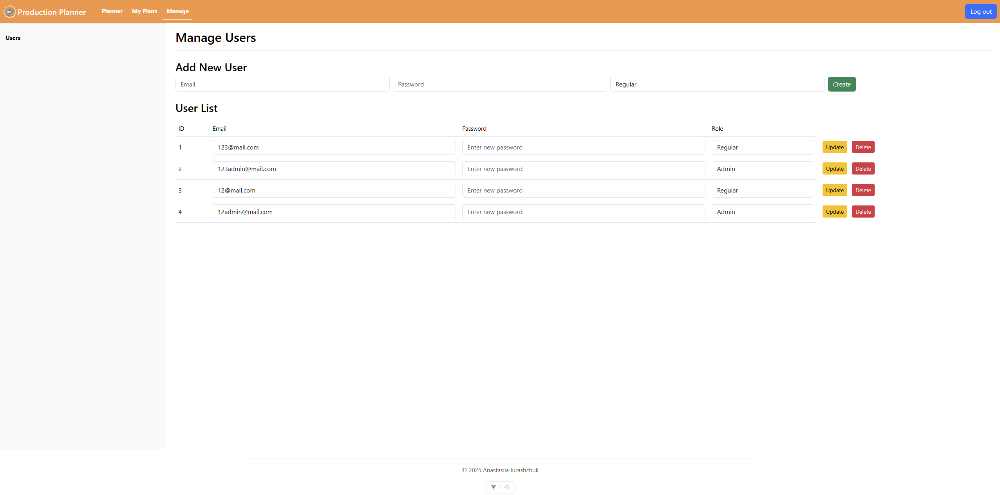

# Production Planner

A full-stack web app for managing production plans, built with Vue.js (frontend) and PHP (backend).

## Project Structure

- `production-planner-frontend`: Vue 3 + Vite application
- `production-planner-backend`: PHP (MVC) REST API with Docker and MariaDB

## Quick Start

See each subfolder’s README for setup and usage.
